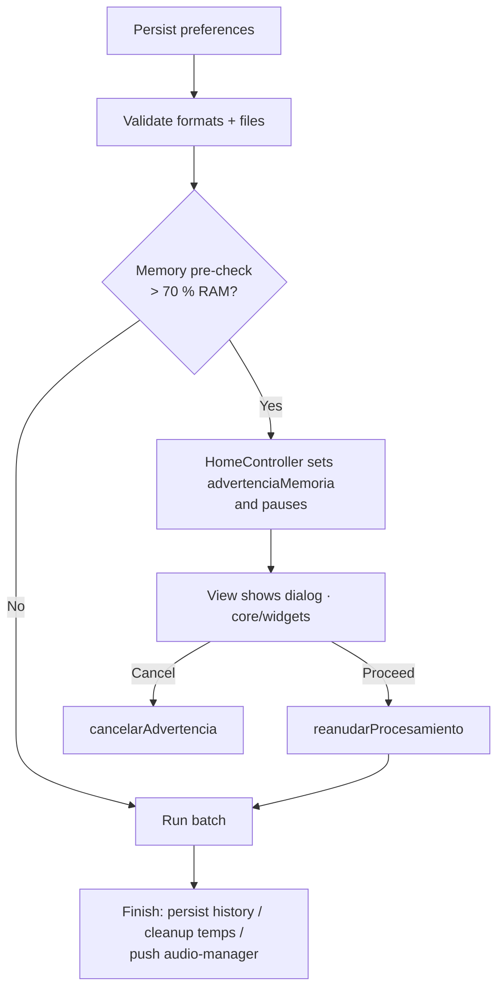
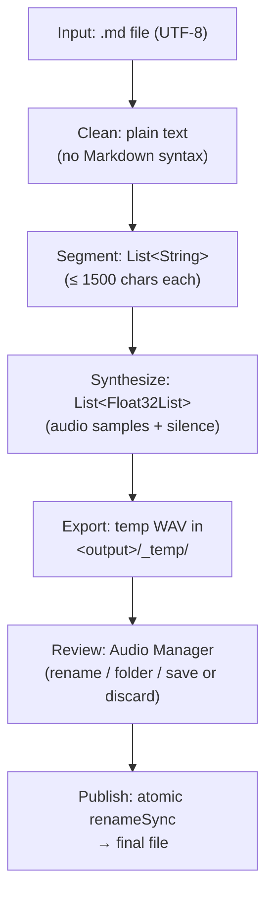

# Audio Processing Pipeline

How Markdown files become audios — the full transformation flow.

## Overview


**Core rule**: synthesis never writes to the final path. Everything stays in `<output_folder>/_temp/` until the user saves from the Audio Manager.

## Pipeline Stages

### 1. Read File

**Use case**: `RepositorioArchivos.leerArchivo()`

- Reads the file as a UTF-8 string
- Read/permission error → `ResultadoProceso.error` (no throw)

### 2. Clean Markdown

**Use case**: `limpiarMarkdown()` (pure function)

Strips all Markdown syntax in order:

| Step | Regex Pattern | Action |
|------|-------------|--------|
| 1 | `~~~.*?~~~` | Remove code blocks |
| 2 | `` ```.*?``` `` | Remove fenced code blocks |
| 3 | `^#{1,6}\s*` | Remove headings |
| 4–9 | `\*{1-3}` / `_{1-3}` | Remove bold/italic/emphasis |
| 10 | `` `{1,3}...`{1,3} `` | Remove inline code |
| 11 | `` | Remove images (keep alt text) |
| 12 | `[text](url)` | Remove links (keep text) |
| 13 | `^\s*>\s?` | Remove blockquotes |
| 14 | `^-{3,}$` | Remove horizontal rules |
| 15 | `^[-*+]\s+` | Remove unordered list markers |
| 16 | `^\d{1,3}[.)]\s+` | Remove ordered list markers |
| 17 | `\n{3,}` | Collapse multiple line breaks |

**Key decisions**:
- Protected abbreviations (Dr., Mr., etc.) — not split at these points
- Anchored patterns prevent false positives (e.g. `2 * 3 * 4` is preserved)
- Empty result after cleaning → `ResultadoProceso.omitido`

### 3. Segment Text

**Use case**: `segmentarTexto()` (pure function, `shared/domain/use_cases/segmentar_texto.dart`)

Splits the clean text into TTS-ready chunks:

```
Step 1: Merge short paragraphs (< 200 chars) into buffer
Step 2: Split long paragraphs (> 1500 chars) by sentences
Step 3: Split oversized sentences by words
Step 4: Split oversized words by characters (last resort)
```

**Constants**: `maxCharsPerSegment = 1500` · `mergeThreshold = 200`

**Abbreviation handling**:
```
Dr. García → Dr\x00 García  (protect)
.split('. ')               (split)
Dr. García                  (restore)
```

### 4. Synthesize

**Use case**: `MotorTts.sintetizar()` → `MotorTtsSupertonic` (contract in `shared/domain/contracts/motor_tts.dart`; implementation in `features/convert/data/repositories/`)

Converts text segments into Float32 audio samples:

```dart
final wav = await motor.sintetizar(
  texto,
  steps: steps,      // 5–12, more = better quality
  speed: speed,      // 0.7–2.0
  lang: lang,        // 'es', 'en', etc.
);
```

**Memory management**:
- Fragments accumulated in memory (`List<Float32List>`)
- When `memoriaAcumulada > presupuesto` → flush to disk via `wavAppend()`
- Mobile budget: 64 MB · desktop: 500 MB (`presupuestoMemoria()`)

**Between fragments**: `silenceSamples` (26460) zeros are inserted for natural pauses.

### 5. Export Temp WAV

**Destination**: `<output_folder>/<stem>_book/_temp/.tmp_<timestamp>_0_wav`

The `ProcesarArchivo` use case:

1. Creates the `_temp/` subdirectory next to the destination base path
2. Writes the working WAV there (never to the final path)
3. Converts any additional requested formats from that WAV (also into `_temp/`)
4. Returns `ProcesarResultado` with `tempPath` pointing to the generated WAV

The caller (`HomeController`) owns the temp file lifecycle.

### 6. Pending Audios (Audio Manager)

After a batch completes without errors, `HomeController` accumulates the `AudioPendiente` list and navigates to `/audio-manager`. From that screen the user decides per audio:

| Action | Implementation |
|--------|----------------|
| **Save** | `GuardarAudio.ejecutar()`: moves the temp to the destination with `renameSync` (atomic). On name conflict adds a `(N)` suffix |
| **Cancel/discard** | Deletes the temp WAVs |

**Orphan cleanup**: at app startup, `LimpiarTemporales` deletes WAVs in `_temp/` older than 24 hours.

## Batch Processing

`HomeController.procesar()` orchestrates the whole batch:



1. Persist preferences (voice, formats, folders)
2. Validate: non-empty formats, `.md` files present
3. Memory pre-check: `_requiereAdvertenciaMemoria` (via `EstimarMemoriaDisponible` +
   `rssProcesoProvider`). If > 70 % RAM → sets `advertenciaMemoria` and pauses; the
   view shows the dialog and calls `reanudarProcesamiento` / `cancelarAdvertencia`
4. For each selected file:
   - `ProcesarArchivo.procesar(...)` → temp WAV
   - Accumulate `AudioPendiente` + history entry (in memory)
5. At the end:
   - Batch completed without cancellation → persist history (cap 100 entries)
   - Cancellation → delete accumulated temps, do NOT persist history
   - Success without errors → push `/audio-manager` with pendings

**Concurrency**: single-threaded. The TTS engine does not support concurrent synthesis.

**Cancellation**: user taps "Cancel" → `cancelar = true`; the current segment finishes, the loop breaks and generated temps are deleted.

## Voice Preview

Fast synthesis without the full pipeline, via `VoicePreviewService` + `SintetizarMuestra`:

```dart
await service.reproducirMuestra(
  voz: voz,
  lang: lang,
  textoMuestra: textoMuestraIdiomas[lang] ?? t.muestra_texto,
);
```

## Benchmark Estimation

If benchmark data exists (`benchmark.json`), after completing a batch the estimated time — computed with `EstimarTiempo` from processed characters — is logged.

## Data Flow Summary


